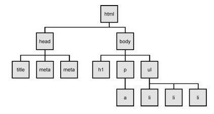

# MustSeeMovies
Print information from MySql database to the web application. 

# To install
Git Clone the repository

Navigate to the folder where the repository exists

Run the command $ npm init (creates package.json)

Run the command $ npm install express body-parser method-overright mysql --save

Run the command $ npm install express-handlebars --save

Run the command $ touch .gitignore, (store node_modules in it)

Then run the command $ server.js

Browser start with search for localhost:3000 

# Built With

* [What is an engine?](https://whatis.techtarget.com/definition/engine) In computer programming, an engine is a program that performs a core or essential function for other programs. 

* [What does render do?](https://www.pathinteractive.com/blog/design-development/rendering-a-webpage-with-google-webmaster-tools/) The rendering engine displays what you see on your screen. It communicates with the networking layer of the browser to grab HTML code and other items passed from a remote server.

* 

* [What is app.use?](https://developer.mozilla.org/en-US/docs/Learn/Server-side/Express_Nodejs/routes) Sets up middleware by calling the Router to the middleware handling path, specifying an URL path.

* FYI - [POST]() is used to create/insert data and [PUT]() used to update data.

# Created By
* Sonia Bradley

# Acknowledgments

Duy Do - Thank you very much for always finding my errors!

